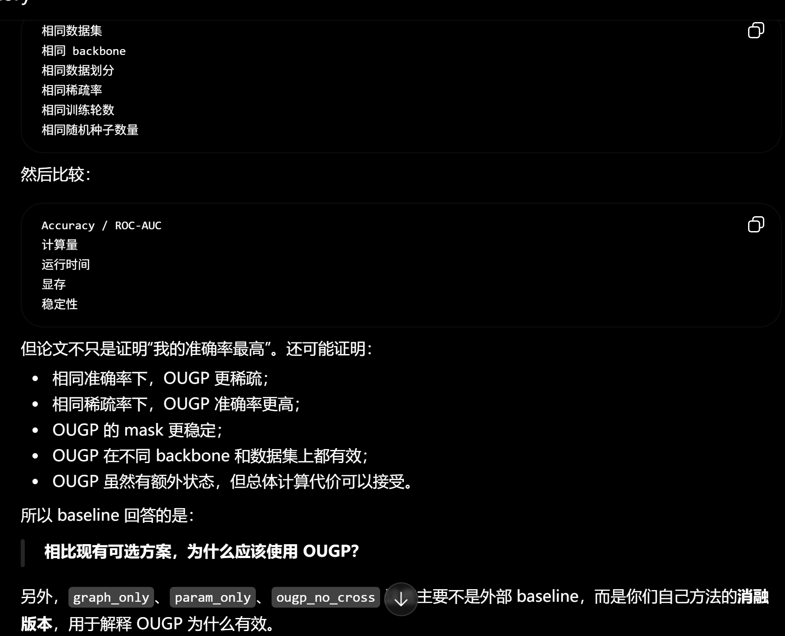

1. OOM 时申请的 tensor shape 是什么？
2. 哪一行代码触发申请？
3. 是否调用了 to_dense？
4. 是否计算了 nodes × nodes 的广播？
5. pruning score 是否能改成只对应 edge_index 中的 E 条边？
6. graph mask 的 shape 应该是 [E] 还是 [N,N]？

它告诉我们 OUGP 的问题不在 graph sparsity，而在 parameter sparsity 的强度、时机和正则策略。下一步应该重点调 sparsity_lambda、warmup、更细的低参数稀疏率，比如 0.025/0.05/0.075/0.10。

OUGP 比静态双剪枝好，说明 online memory 确实在帮忙。但它还是低于 graph_only 的 0.8263，说明当前 memory 机制只能缓解损失，不能完全替代被剪掉的模型容量。

Amazon Photo 可能更依赖特征表达，而不只是图结构
Cora/CiteSeer/PubMed 是 citation network，图结构本身很强。Amazon Photo 是商品共购网络，节点特征和类别区分可能更依赖商品属性特征。参数剪枝会削弱特征变换能力，所以伤害更明显。

当前剪枝 schedule 可能太激进
你的设置是 120 epochs，15 epochs warmup，然后逐渐达到目标稀疏率。对 graph mask 这可能没问题，但对 parameter mask 来说，模型还没完全学稳时就开始丢参数，后面很难恢复。

